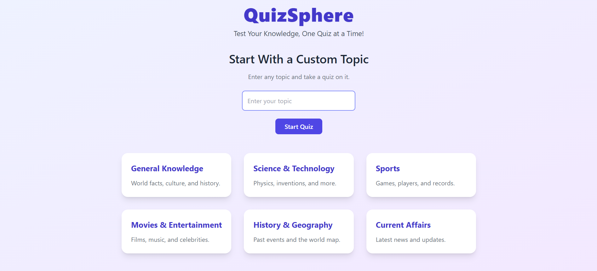
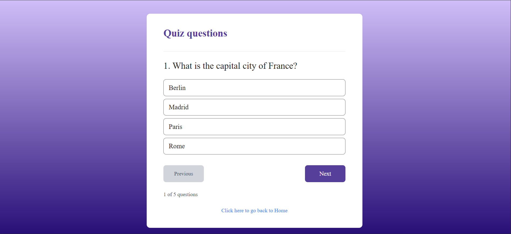
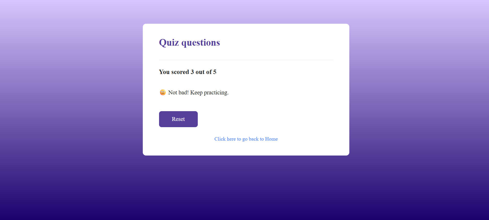

# 🤖 AI Quiz App

An interactive quiz application powered by AI that generates multiple-choice questions (MCQs) dynamically based on selected topics. Built with **React**, **TailwindCSS**, and integrated with Gemini API for question generation.

---

## 🚀 Features

* 🎯 AI-generated multiple-choice questions
* 📊 Progress tracking and score calculation
* 💡 Instant feedback on answers
* 🎨 Responsive UI with TailwindCSS
* 🔄 Retry mechanism to handle malformed AI responses

---

## 🛠️ Tech Stack

* **Frontend:** React, TailwindCSS, React Router DOM
* **Backend / AI:** Gemini AI
* **State Management:** React Hooks
* **HTTP Requests:** Axios

---

## 📂 Project Structure

```
## 📂 Project Structure

```
plumFront/
│── public/               # Static files served directly
│── screenshots/          # App screenshots for README
│── src/                  # Main source code
│   ├── assets/           # Images, data, or static resources
│   ├── components/       # Reusable UI components
│   ├── LandingPage.jsx   # Landing page component
│   ├── Quiz.jsx          # Quiz component
│   ├── App.jsx           # Root app component
│   ├── main.jsx          # React entry point
│   └── index.css         # Global styles
│── .gitignore            # Files to ignore in git
│── README.md             # Project documentation
│── index.html            # HTML template
│── vite.config.js        # Vite configuration
│── tailwind.config.js    # TailwindCSS configuration
│── postcss.config.js     # PostCSS configuration
│── eslint.config.js      # ESLint configuration
```

```

---

## ⚡ Getting Started

### 1. Clone the repo

```bash
git clone https://github.com/shrajjal/plumFront.git
cd plumFront
```

### 2. Install dependencies

```bash
npm install
```

### 3. Add environment variables

Create a `.env` file in the root directory:

```
VITE_API_KEY=GEMINI_API_KEY
```

### 4. Run the app

```bash
npm run dev
```

---

## 🎮 Usage

1. Select a topic (e.g., General Knowledge, Science, Movies).
2. You can also enter any custom topic for quiz.
3. AI generates 5 MCQs dynamically.
4. Answer questions one by one.
5. View your score and get custom AI feedback.

---

## 📸 Screenshots

### 🏠 Landing Page



### 📝 Quiz Question



### 🏆 Result Page



> 📌 Place your screenshots in a `screenshots/` folder in the root directory and update the paths above.

---

## 🤝 Contributing

Contributions are welcome! Feel free to open an issue or submit a pull request.

---

## 📜 License

This project is licensed under the MIT License – see the [LICENSE](LICENSE) file for details.

---

## 👨‍💻 Author

Developed by **[Your Name](https://github.com/your-username)** 🚀
